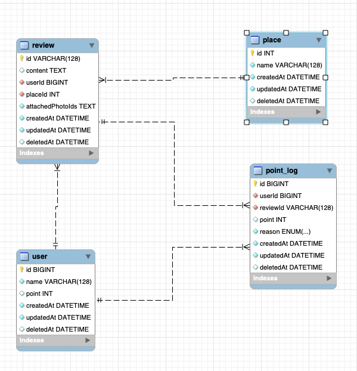

# 트리플 과제

## 1. 설계 방향

### 가. Layer 분리

#### Router - Controller - Service - DB 분리

> 각 기능별 Layer을 분리

1. Router: 경로별 필요한 controller로 라우팅
2. Controller: request 정보 가운데 Service에서 필요한 정보를 추출하여 Service 호출
3. Service: 직접적인 로직이 구현되는 단계 Controller로부터 받은 req 정보를 전달받아 DB에 필요한 형태로 데이터를 가공하여 전달 및 DB에서 전달받은 결과 값을 클라이언트에 전달하기 위해 데이터 가공. 가능한 요청인지(ex. 실제 존재하는 강의를 수강하려고 하는지 확인) 확인하는 기능 수행.
4. DB: Service에서 전달받은 sql 쿼리를 수행하고 결과 값 전달.


## 2. 프로젝트 실행 방법

1. pc환경에 Node가 설치되어 있어야 합니다. [Node설치 링크](https://nodejs.org/ko/)
2. mysql, redis가 설치되어 있어야 합니다.
3. 아래에 있는 ERD모델로 DB가 준비되어 있어야 합니다. triple.sql파일을 사용해서 DB를 생성하면 쉽게 생성 할 수 있습니다.
4. 아래의 환경변수가 필요합니다.
```
PORT
MYSQL_HOST
MYSQL_USERNAME
MYSQL_DATABASE
MYSQL_PASSWORD
MYSQL_PORT
REDIS_HOST
```

### 가. 프로젝트 실행 방법

- node_modules 설치

```bash
$ npm install
```

- 서버 구동

```bash
$ npm run start
```

## 3. ERD



